# hookdrift

[](https://www.npmjs.com/package/hookdrift)
[](https://github.com/balboubal/hookdrift/actions/workflows/ci.yml)
[](package.json)
[](LICENSE)

**Detect when a third-party webhook payload changes shape — before it silently breaks your handler in production.**

You're moving to a new Stripe API version, or Shopify is moving you to one. A field is gone, a type changed, something is nullable now. Your handler doesn't error — delivery succeeds, you return 200, every monitor stays green — but your code reads a field that isn't there any more, and you find out days later from a customer.

hookdrift infers a structural contract from webhook payloads on disk, commits it to git, and fails CI when new payloads stop matching it. For a version upgrade both payload sets exist *before you deploy*, because Stripe and Shopify will generate them for you on demand.



<sub>The demo above is an animated SVG (SMIL `<animate>`, no `<style>` dependency, so it degrades to a readable static frame anywhere animation is stripped). Output is copied from a real run against [`examples/demo`](examples/demo).</sub>

**Case study:** [a field disappeared from Shopify webhooks for two days and every monitor stayed green](docs/case-study-shopify-april-2026.md) — a real, resolved incident, with a runnable reproduction.

## Quickstart

```bash
# 1. Point it at a folder of saved webhook payloads (JSON, one per file)
npx hookdrift init
# edit hookdrift.config.json: set your fixtures glob and event field

# 2. Build contracts and commit them
npx hookdrift infer
git add .hookdrift && git commit -m "webhook contracts"

# 3. In CI (or whenever you save fresh payloads): diff against the contracts
npx hookdrift check          # exit 1 on breaking drift
npx hookdrift impact         # map findings to the code that reads those fields
```

A provider changing their payload now shows up as a **reviewable diff in a pull request**, with severity attached and the consuming code lines listed.

## The upgrade workflow

This is the case hookdrift is strongest at, because you can get both sets of payloads **before anything ships** — the providers hand them to you.

### Stripe

Stripe's own [webhook versioning guide](https://docs.stripe.com/webhooks/versioning) recommends running two endpoints in parallel through an upgrade: the same URL distinguished by a query parameter, one pinned to your current `api_version` and one to the target. While both are enabled you are receiving each event in both shapes — that is two fixture sets straight from production traffic.

You can get the same pair locally without touching production. In one terminal:

```bash
stripe listen --format json > current.jsonl
```

and, for the newest version:

```bash
stripe listen --latest --format json > target.jsonl
```

In a second terminal, `stripe trigger charge.succeeded` (and whichever other events you consume) to produce them. `--latest` is documented as "receive events used in the latest API version"; without it you get your account's default.

> Stripe's docs still show `--print-json`. As of CLI 1.45 that flag is deprecated in favour of `--format json` — it still works but prints a deprecation notice.

Split either capture into one file per event with [`examples/stripe-live/split-jsonl.mjs`](examples/stripe-live/split-jsonl.mjs).

### Shopify

Shopify's CLI generates a payload for whichever API version you name, before you deploy:

```bash
shopify app webhook trigger --topic orders/updated --api-version 2025-07 --address http://localhost:3000/webhooks
shopify app webhook trigger --topic orders/updated --api-version 2026-01 --address http://localhost:3000/webhooks
```

Save what your endpoint receives into a folder per version. This matters more for Shopify than for Stripe, because Shopify's version deprecations are scheduled rather than optional — [2025-01 removed `tags`, `total_spent` and `orders_count`](https://shopify.dev/docs/api/release-notes/2025-01) from customer webhook payloads, for instance.

### Then diff the two

First point the provider's `fixtures` glob at **both** directories, because the optional directory argument *filters* that glob rather than replacing it:

```jsonc
"providers": {
  "stripe": { "fixtures": "fixtures-{current,target}/**/*.json", "eventPath": "type" }
}
```

Then:

```bash
npx hookdrift infer fixtures-current    # contract from the version you run today
npx hookdrift check fixtures-target     # does the target version still match it?  exit 1 on breaking
npx hookdrift impact                    # which of your code reads the fields that changed
```

(If the glob does not cover the directory you pass, you get `no fixtures matched` and exit 1 — the argument narrows, it never widens.)

You get the break list, with severity and the source lines touching each field, while the upgrade is still a branch.

## Where fixtures come from

hookdrift compares payloads that are already on disk, so it is exactly as current as your corpus. That cuts differently depending on the change:

- **API version upgrades — strongest.** Both sets exist ahead of the deploy, generated on demand as above. Nothing reaches production before you have diffed it.
- **Announced changes — strong.** The provider's changelog tells you something is coming; capture fresh samples and check them against the committed contract.
- **Unannounced drift — weakest, and worth saying plainly.** A genuinely surprising change reaches production *before* it reaches your fixtures. hookdrift catches it on your next capture, which turns "days, reported by a customer" into "next CI run, with the affected code listed" — but it does not stop the first bad payload. No fixture-based tool can. If you need that, you need something in the delivery path, which is a different product.

## What it detects

| Severity | Examples | Exit code |
|---|---|---|
| **BREAKING** | field removed; incompatible type change (`string → number`, scalar ↔ array); non-nullable field goes null; field moved (reported as a move, not delete+add); enum value disappears from an enum declared authoritative | 1 |
| **WARNING** | required field becomes optional; **new enum value appears** (breaks exhaustive `switch`es — the classic silent failure); string format changes; integers-only field starts sending floats | 0 (1 with `--strict`) |
| **INFO** | new optional field; presence ratio shifts; type widening on polymorphic/expandable fields | 0 |

`check` also exits 1 when its fixtures globs match nothing at all — a run that checked nothing is a failure, not a pass, and `explain`/`impact` mirror that state rather than reporting health.

False-positive control is a design goal, not an afterthought:

- **Expandable fields** (Stripe-style: an ID string *or* the expanded object, depending on your own request params) are detected automatically and get `"polymorphic": true` in the contract. The evidence bar is deliberately strict: only *coexistence* — both shapes present in the same batch, strings all provider IDs — is treated as INFO, because coexistence is what proves both shapes are currently legitimate. If every payload flips to the other shape, that is a WARNING, not INFO: code reading the old shape breaks whether the cause was expansion being toggled or the provider genuinely replacing the field.
- **Minimum-sample guards**: one missing payload is not evidence. Presence findings downgrade to INFO below `minSamples` (default 10), and a *baseline* thinner than `minSamples` cannot produce a BREAKING removal at all — one observation is not enough to call a field required.
- **Enum removal is a WARNING by default.** hookdrift stores which values it saw, not how often it saw each one, so it cannot distinguish "this value was removed" from "this rare value went unsampled" — a value seen once in 1,000 observations is missing from 60 fresh samples about 94% of the time with nothing changed. Set `"enumAuthoritative": true` on a field whose value set the provider documents as closed, and removal becomes BREAKING (given ≥ 0.95 confidence and ≥ 50 new observations).
- **Ignore rules** with mandatory visibility: suppressed findings are counted in every summary (`2 breaking, 5 warnings (1 suppressed)`) and shown with `--show-suppressed`. Nothing is ever silently dropped.

## Config reference

`hookdrift.config.json`:

```jsonc
{
  "contractsDir": ".hookdrift",          // where contracts live (commit this)
  "providers": {
    "stripe": {
      "fixtures": "test/fixtures/stripe/**/*.json",
      "eventPath": "type"                // payload field holding the event name
    },
    "github": {
      "fixtures": "test/fixtures/github/**/*.json",
      "eventPath": "@dirname"            // GitHub sends the event in a header,
    }                                    // so use the fixture's folder name
  },
  "source": ["src/**/*.{ts,js,tsx}"],    // searched by `hookdrift impact`
  "strict": false,                       // warnings fail CI too
  "minSamples": 10,                      // below this, presence findings are INFO
  "failOnSkipped": false,                // fail if a matched fixture could not be parsed
  "failOnUncontracted": false,           // fail if an event has no committed contract
  "ignore": [
    {
      "path": "data.object.metadata.**", // wildcards are trailing-only: `*` = exactly one
                                         // more segment, `**` = one or more
      "kind": "new_field",               // omit to suppress all kinds here
      "reason": "merchant-controlled free-form keys"
    }
  ]
}
```

Commands: `init` · `infer [dir]` (`--rebuild` to allow narrowing) · `check [dir]` (`--strict`, `--json`, `--show-suppressed`, `--fail-on-skipped`, `--fail-on-uncontracted`) · `impact` (`--strict`) · `explain`.

### Proving what a green run actually checked

An empty findings list is not the same as a complete check. `--json` and `.hookdrift/last-run.json` carry a `coverage` block — files matched, files parsed, files skipped with reasons, events observed, contracts compared, contracts that received no fixtures, and events with no committed contract — so a wrapper can tell "nothing drifted" apart from "nothing was looked at".

Two holes can be made fatal. `--fail-on-skipped` fails the run when a matched fixture could not be parsed (the unreadable file may be the one carrying the breaking shape). `--fail-on-uncontracted` fails it when fixtures contain an event with no committed contract. Both default to off so an upgrade changes nothing until you ask for it; for a gate, turn both on.

## GitHub Action

```yaml
permissions:
  contents: read
  pull-requests: write # required for the PR comment; omit to skip commenting

steps:
  - uses: actions/checkout@v7
  - uses: balboubal/hookdrift@v0.1.3
    with:
      strict: false
      version: "0.1.3" # exact CLI version; pinning keeps a green commit green
      # Coverage gates - off by default, worth turning on for a real gate:
      fail-on-skipped: false # fail if a matched fixture could not be parsed
      fail-on-uncontracted: false # fail if an event has no committed contract
```

Pin the action by tag (or commit SHA in high-assurance setups) and pin `version` to an exact release — the CLI version is what determines the result, and an unpinned one lets a passing commit run different code later. On fork pull requests the token is read-only, so the comment step is skipped without failing the job; the check's exit code still decides the outcome.

Posts **one** PR comment, updated in place on re-runs. No findings → no comment. If a previous run reported drift that is now resolved, the existing comment is updated to say so.

## What this is *not*

- **Not webhook infrastructure.** No receiving, routing, queueing, retries, or replay — Hookdeck, Svix, and Convoy do that well. They monitor *delivery*; hookdrift monitors *shape*. A 200 response with a broken field looks healthy to them by design.
- **Not a schema registry or contract-testing framework.** Pact needs cooperation from the producer; you do not control Stripe.
- **Not a payload store.** Contracts contain field paths, types, formats and presence ratios rather than the values in your payloads — with two documented exceptions: **object keys become path segments** (so a map keyed by email or tenant id puts those keys in the contract), and **inferred enum values are stored verbatim**. Both are spelled out in [SECURITY.md](SECURITY.md); review contracts before committing if your payloads carry dynamic keys.

## Honest limitations

- **Fixture-based**, with the consequences spelled out in [Where fixtures come from](#where-fixtures-come-from) — it cannot catch a surprise change before that payload has reached you at least once.
- **`impact` is textual matching**, not AST resolution. It will miss dynamic access (`payload[key]`) and can flag unrelated uses of common field names. Treat it as a ranked starting point.
- **Inference needs volume.** Enums require ≥ 30 observations; presence ratios stabilize with sample count. `infer` merges new samples and only ever widens — narrowing requires an explicit `--rebuild`.
- **`infer` merges by sample count, not by file identity.** Re-running it over the same unchanged corpus counts those payloads again, so `samplesObserved` grows (24 files → 24, then 48, then 72). Presence ratios stay proportionally right, but the evidence counts cited in findings will exceed the number of files on disk. Re-run `infer` when you capture *new* payloads; use `--rebuild` to reset to exactly what is on disk.

## Zero network calls

hookdrift reads local files and writes local files. There is no telemetry, no phone-home, nothing. This is enforced by [a test](test/no-network.test.ts) that boobytraps `fetch`, `http`, `https`, and raw sockets and then runs every command.

## License

MIT
